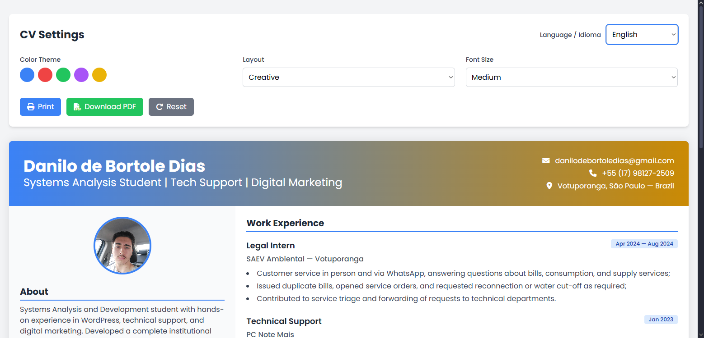

# Currículo Digital Interativo

Projeto de currículo online desenvolvido com **HTML, CSS e JavaScript**.  
Possui troca de idioma (Português e Inglês), mudança de tema, ajuste de layout, exportação para impressão/PDF e personalização visual.
🔗 **Veja online:** [Currículo Digital Interativo](https://danileira.github.io/diasdanilo.github.io/)


## ✨ Funcionalidades

- 🌐 Troca de idioma (Português/Inglês)
- 🎨 Alteração de tema (azul, vermelho, verde, roxo, índigo)
- 📐 Opções de layout (Standard, Modern, Creative)
- 🔠 Ajuste de tamanho da fonte
- 🖨️ Impressão e exportação para PDF
- 📂 Seções: Sobre, Habilidades, Experiência, Educação, Projetos, Certificados

## 🛠 Tecnologias

- HTML5
- CSS3 (TailwindCSS)
- JavaScript
- Font Awesome (ícones)
- Google Fonts (Poppins)

## 🚀 Como executar

1. Clone este repositório
   ```bash
   git clone https://github.com/seu-usuario/curriculo-digital.git

2. Entre na pasta do projeto
cd curriculo-digital

3. Abra o arquivo index.html no navegador

## 📄 Licença
Este projeto está sob a licença MIT. Fique à vontade para usar e modificar.
